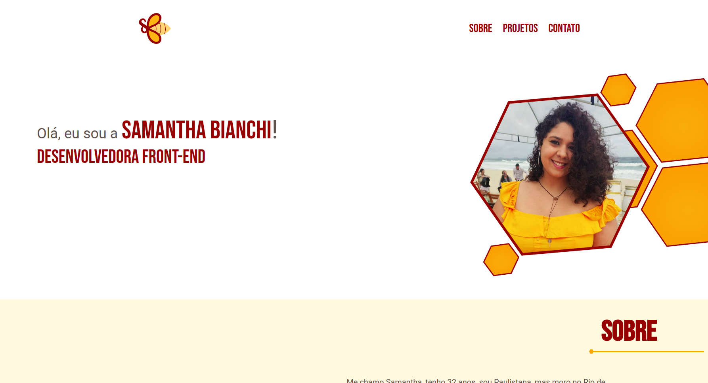

# Portfólio

    

 

Portfólio é um projeto pessoal para me apresentar e mostrar os meus projetos de estudo.
Esse projeto foi criado apenas com HTML/CSS, porém pretendo refatorar ele em breve para a estrutura de React.
Além disso ele também está responsivo para celular.

 

## 📦 Desenvolvimento

### 🛠️ Construído com

* [Figma](https://www.figma.com/) - Design UX-UI.
* [HTML](https://developer.mozilla.org/pt-BR/docs/Web/HTML) - Linguagem de marcação utilizada no Front-end.
* [CSS](https://developer.mozilla.org/pt-BR/docs/Web/CSS) - Utilizado para estilização das páginas no Front-end.
 

## ✏️ Produto | Processo Criativo

### 🏷️ Branding

Toda a criação do layout também foi feita por mim no figma.

      
    A logo tem a letra "S" inicial do meu nome representando a cabeça da abelha e a letra "B" inicial do meu sobrenome formam as asas da abelha.
    A abelha tem um significado espiritual para mim e por isso a utilização dela para criar a minha logo e identidade visual

 

### 💻 Deploy
Você pode visualizar o deploy do portfólio através [desse link](https://portfolio-sahbianchi.vercel.app).
